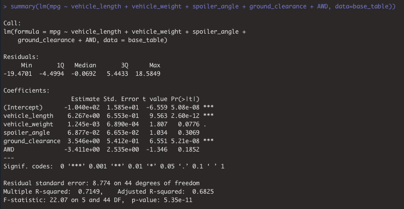
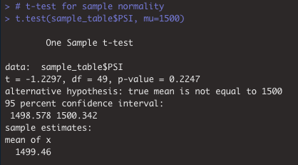
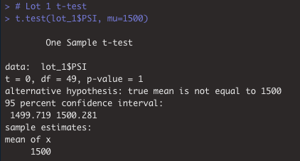
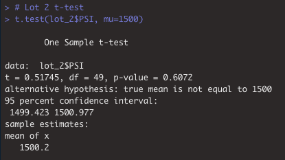
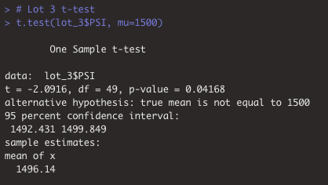

# MechaCar_Statistical_Analysis
BC Mod15  

## Overview
lorem ipsum  

### Resources
Programming Language(s): R  
Data: MechaCar_mpg.csv, Suspension_Coil.csv  

## Results
lorem ipsum  

### Linear Regression to Predict MPG
In order to determine the significance of variables predicting Miles Per Gallon (MPG), a multiple linear regression model was run in R using the following line of code:  

  lm(mpg ~ vehicle_length + vehicle_weight + spoiler_angle + ground_clearance + AWD, data=base_table)  

While this provides the model and coefficients for each variable. We need the following code to provide the information to answer some relevant questions:  

  summary(lm(mpg ~ vehicle_length + vehicle_weight + spoiler_angle + ground_clearance + AWD, data=base_table))  

  

#### Which variables/coefficients provided a non-random amount of variance to the mpg values in the dataset?  
The two variables that appeared to have a significant impact on MPG were vehicle_length and ground_clearance. This is due to their respective p-values each being lower than 0.05. The p-value of vehicle_length was 2.60e-12. The p-value of ground_clearance was 5.21e-08.  

#### Is the slope of the linear model considered to be zero? why or why not?  
The overall p-value of the model was 5.35e-11. This is significantly lower than 0.05, so we conclude that there is significant evidence to reject the null hypothesis. That is, the slope is not zero.  

#### Does this linear model predict mpg of MechaCar prototypes effectively? Why or why not?  
The multiple R-squared value of this formula is 0.7149. With two variables providing a significant impact on MPG, the model explains approximately 71.5% of the impact on MPG. The other variables in our model (vehicle_weight, spoiler_angle, and AWD) do not have a significant impact on the MPG. Further exploration would be required to determine their full impact.  

### Summary Statistics on Suspension Coils  
The following images provide the summary statistics on the Suspension Coils. The first image shows the entire dataset. The second provide summary statistics based on manufacturing lot.  

  

  

#### Does the current manufacturing data meet the design specification (must not exceed 100 PSI) for all manufacturing lots in total and each lot individually? Why or why not?  
The design specification regarding PSI is that the variance must not exceed 100 PSI. The total summary shows a variance of 62.29 PSI which is acceptable. Regarding the variance by lot, Lots 1 and 2 meed the design specifications, with a variance of 0.98 (Lot 1) and 7.47 (Lot 2). Lot 3, however, shows a variance far outside of the design specifications, with a variance of 170.29.  

### T-Tests on Suspension Coils  
T-tests were performed both on a random sample and on individual manufacturing lots in order to determine whether the PSI differed significantlyfrom the population mean of 1,500 PSI.  

  

The p-vale for our random sample subset of the population was 0.225. This is above our significance level of 0.05. Therefore, there is not sufficient evidence to reject the null hypothesis. This suggests that the two populations are statistically similar.  

  

The p-vale for the Lot 1 subset of the population was 1. This is above our significance level of 0.05. Therefore, there is not sufficient evidence to reject the null hypothesis. This suggests that the two populations are statistically similar.  

  

The p-vale for the Lot 2 subset of the population was 0.607. This is above our significance level of 0.05. Therefore, there is not sufficient evidence to reject the null hypothesis. This suggests that the two populations are statistically similar.  

  

The p-vale for the Lot 3 subset of the population was 0.042. This is below our significance level of 0.05. Therefore, there is sufficient evidence to reject the null hypothesis. The two populations are not statistically similar to one another.  

## LOREM IPSUM
lorem ipsum
